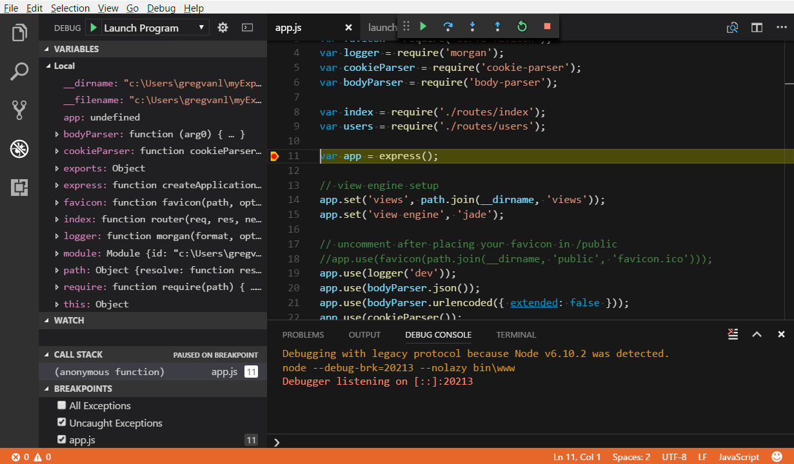

<br/>
<br/>

Empezar una carrera profesional es una importante decisión ya que posiblemente tengas que invertir meses o años de tu vida en llevarla adelante. Si has decidido entrar al área del desarrollo web, permíteme felicitarte, porque es una carrera emocionante y altamente demandada a nivel mundial. Pero antes de emprender tu camino, te aconsejo que respondas a preguntas básicas como estas:

1. ***¿Me gusta la Programación?***
2. ***¿Conozco los tipos de desarrolladores web que existen?***
3. ***¿Qué medios voy a utilizar para mi preparación?***
4. ***¿Qué nivel de desarrollador web deseo alzanzar?***


Las respuestas a las preguntas anteriores tendrán influencia en tu ruta de aprendizaje y en la distancia a tus metas.

En este artículo te ayudaremos a responder a esas y otras preguntas que te ayudarán a comenzar con buen pié tu carrera de Desarrollador Web.


### TABLA DE CONTENIDO

- <LocalLink to="PREGUNTAS-BASICAS">Respuestas a Preguntas Básicas</LocalLink>

- <LocalLink to="HERRAMIENTAS-BASICAS">Herramientas básicas para empezar</LocalLink>

- <LocalLink to="RUTA-INICIAL">Ruta inicial de todo desarrollador web</LocalLink>

- <LocalLink to="CONCLUSIONES">Conclusiones</LocalLink>

- <LocalLink to="ENLACES">Enlaces de Interés</LocalLink>


##### PREGUNTAS BASICAS {#PREGUNTAS-BASICAS}

No puedes comenzar una nueva carrera sin antes responder a algunas preguntas importantes que tienen que ver con tus aspiraciones y tus conocimientos sobre la carrera en sí.

1. ***¿Me gusta la Programación?***  El desarrollador web es, por definición, un **programador**. Si ya sabes programar en algún lenguaje o tienes nociones, puedes continuar. Si no tienes idea de lo que hace un programador, te invito a investigar sobre el tema en internet. Al final del artículo te dejo algunos links interesantes sobre el tema. Si un eres apasionado de la programación tendrás ganada la mitad de la batalla.

2. ***¿Conozco los tipos de desarrolladores web que existen?***  El Desarrollo Web es una carrera inmensamente amplia y continúa en constante expansión. Es casi imposible que una sola persona puede abarcar toda su area de conocimientos, por eso es importante conocer las áreas y lenguajes más importantes para estar preparados a la hora de decidir por una (o varias de ellas). En este artículo no profundizaré sobre estas áreas, ya que serán tema de otros artículos en este blog. Sin embargo te menciono que todo desarrollador web puede especializarse en:

    - ***Front-End:*** Consiste en el desarrollo de aplicaciones en el Navegador Web (Microsoft Edge, Google Chrome, Mozilla Firefox, entre otros). El desarrollo front-end tiene que ver con toda la parte de la aplicación que maneja el usuario(IU): Diseño de páginas, menús, imágenes, botones, formularios, etc. Está muy relacionado con el diseño web, por lo que un buen desarrollador front debe saber algo de diseño gráfico.

    - ***Back-End:***  El desarrollo Back-End se centra en las aplicaciones que corren en el ***Servidor Web***. Estas aplicaciones son las que reciben los datos del navegador (front) y devuelven información que necesita la aplicación front-end para funcionar. Un buen ejemplo de Back-End puede ser una API REST, que corre en un servidor y recibe peticiones http de cualquier aplicación front o de otros back-ends (por eso se dice que esas aplicaciones ***consumen*** la API) y responde con la data solicitada.


Dentro del Front-End y Back-End existen variedad de tecnologías (lenguajes de programación, frameworks y librerías), algunas de las cuales se agrupan (o se utilizan unidas) en un ***Stack de tecnologías*** o simplemente ***Stack***.

Cualquier desarrollador que es capaz de programar aplicaciones utilizando determinado Stack, comunmente se le denomina ***Desarrollador Web Full Stack***. Esto no implica que es una persona que lo sabe todo, simplemente posee los conocimientos para desarrollar aplicaciones en determinado Stack de tecnologías.

Inicialmente todos los desarrolladores deben dominar aspectos que se explican más adelante, pero en cierto punto de tu preparación te tocará decidir por el Front-End o el Back-End.

3. ***¿Qué medios voy a utilizar para mi preparación?***  Afortunadamente hoy en día las fuentes de aprendizaje abundan. En internet existen cientos (si no miles) de cursos online que te llevarán de la mano para empezar, aunque en mi opinión la mayoría de los cursos son muy generales y solo tocan la superficie de un tema. Utiliza los cursos solamente como una **Introducción** al tema que vas a aprender, y luego puedes profundizar con libros y artículos especializados. Existen websites que son fuentes de referencia esenciales, como <a href="https://developer.mozilla.org/es/" target="_blank">Mozilla Developer Netword(MDN)</a>, allí encontrarás respuesta a prácticamente cualquier consulta sobre HTML, CSS y Javascript. Los libros son una excelente forma de profundizar en un tema, pero los mejores libros técnicos están en el idioma inglés. En <a href="https://www.amazon.com/" target="_blank">Amazon</a> puedes descargar el Kindle Cloud Reader y comprar libros digitales apenas sean publicados, es importante que adquieras libros de muy reciente publicación, porque la tecnología del desarrollo web está cambiando constantemente y tu deseas mantenerte actualizado con los último avances. Pero no es esencial que compres libros, en internet existen toneladas de tutoriales y artículos donde aprenderás todo lo necesario, si sabes buscar.


4. ***¿Qué nivel de desarrollador web deseo alzanzar?*** Por último, tienes que estar consciente del nivel que deseas alcanzar y cuánto tiempo y esfuerzo requieres para llegar a él. Puede ser que solo deseas hacer páginas personales como un hobby, o esperas ser capaz de realizar proyectos para una organización. Tu pasión y tu ambición serán tus motores para continuar avanzando en tus conocimientos. Debes trazar un plan, hacer una lista de puntos a temas de interés que debes cubrir y dejar a un lado aquellos temas que no necesitas. 


##### HERRAMIENTAS BASICAS {#HERRAMIENTAS-BASICAS}

Existen herramientas básicas que todo programador web debe conocer y utilizar, estas son:

- ***EDITOR DE CODIGO WEB:*** La herramienta más importante que cualquier desarrollador web es, sin duda, un editor de código que ofrezca todas las funciones necesarias y comodidad de uso. Para desarrollo web, el editor de código debe, como mínimo, facilitar la escritura y edición de código HTML, CSS y Javascript. Es habitual que los editores de código web te permitan una vista previa de la aplicación en el navegador. Personalmente recomiendo <a href="https://code.visualstudio.com/" target="_blank">Visual Studio Code</a> por ser gratuito, estable, open source, robusto y altamente personalizable. Ya sea un proyecto básico y complejo, este editor de código ha demostrado estar a la altura. Además está entre los más utilizados a nivel mundial. Sin embargo, tu eliges el editor que más te guste, al final del artículo te dejo una lista de los más populares.




<br/>
<br/>

- ***Git - SOFTWARE DE CONTROL DE VERSIONES:*** Otra herramienta básica de todo programador. Te explico por qué. Cuando desarrollas una aplicación, vas a llegar a un punto en el que ya puede ser utilizada por los usuarios, le haces un *build* o la compilas y la sacas a producción. ¿Pero qué ocurre si hay alguna falla que debes corregir? ¿o alguna mejora que debes agregar? Tienes que irte al código fuente y hacer los cambios, pero, ¿y si esos cambios afectan a otras partes del código? Lo ideal sería que hicieras una copia del código fuente para trabajar en los cambios, y dejar el código *maestro* en su estado original. ¿Y si son varias personas las que trabajan en esos cambios al mismo tiempo en el mismo proyecto? Todo se complica. Pues para todo eso está <a href="https://git-scm.com/" target="_blank">Git</a>. Es un sistema de control de versiones creado por *Linus Torvalds*, que te permite controlar el estado y los cambios realizados a tu proyecto, mediante los conceptos de *repository*, *commits* y *branches*. Aprender a utilizarlo es cuestión de pocas horas, y en su página te llevará a un link que te explicará su uso paso a paso.

##### RUTA INICIAL {#RUTA-INICIAL}
    
Para empezar tu preparación como Desarrollador(o Programador) Web, debes estudiar paso a paso los temas a continuación:

1. ###### HTML
HTML significa *Lenguaje de Marcas de Hiper-Texto*, y es un lenguaje que define la *estructura de las páginas web*, así como el esqueleto define la estructura de un ser humano, el esqueleto de las páginas web se hace en bloques utilizando HTML. Basicamente consiste en *Etiquetas* y *Atributos* que le dan estructura y semántica al contenido de las páginas web. Cuando el navegador va a mostrar una página web, debe leer el HTML para saber como darle forma a la página, así como la semántica o significado de la información que contiene. Es fundamental conocer bien HTML antes de pasar al siguiente punto.

```html

<!DOCTYPE html>
<html lang="en">
<head>
    <meta charset="UTF-8">
    <meta name="viewport" content="width=device-width, initial-scale=1.0">
    <title>Document</title>
</head>
<body>
    <h1>EJEMPLO DE HEADER H1</h1>
    <p>Ejemplo de Párrafo</p>
</body>
</html>
   
```


2. ###### CSS
CSS significa *Hojas de Estilo en Cascada* y es un lenguaje de estilos que permiten darle *apariencia a la página web*. Con HTML le damos la estructura y la semántica, con el CSS definimos la ubicación o *layout* de los elementos de la página, los colores de texto y fondo, el tipo de letra, y un largo etc. El darle layout a una página es lo que se denomina *maquetación*. Con CSS incluso podemos darle algunos efectos interactivos y animaciones a la página, sin tener que usar Javascript.

```css

#masthead {
    width: 100%;    
    color: white;
    height: 100vh;
    min-height: 100vh;
    position: relative;
    border-bottom: 1px solid blue;
}
    
```

3. ###### Javascript
Cuando llegas a este punto es donde comienzas a hacerte *programador*. Javascript es el lenguaje de programación más popular del mundo y es el que te permite hacer cosas increíbles en las páginas web. Hoy en día sigue en expansión mediante tecnologías que crecen como Node.js, React.js, Angular, Vue.js, Gatsby.js, y muchas otras. Javascript es el lenguaje que le da *vida* a las páginas web ya que permite hacer cualquier cosa con ellas.

Luego de dominar Javascript, ha llegado el momento de tomar la decisión de irte por el lado del Front o del Back-End, ya que estudiar los dos al mismo tiempo es difícil. En mi caso estudié Front primero, y luego aprendí Back-End. Te recomiendo hacerlo de esa manera porque así cuando estés aprendiendo Back-End ya sabes lo que estás pasando en el Front.

Una vez decidas si irte por el Front o Back-End, el siguiente paso natural es seleccionar un Framework o Librería de Front o de Back. En el Front, los más populares son React.js, Angular y Vue.js, cada una con sus ventajas y sus desventajas. En el Back-End se suele escoger entre lenguajes de programación como PHP, Phyton o Node.js que es el mismo Javascript para servidor, y cada uno tiene sus tecnologías asociadas.

En este blog estaremos trabajando en el Front con React.js y todas sus librerías, y en el Back con Node.js, Express y Apollo Server. La ventaja de utilizar Node.js en el Back-End es que no tienes que aprender un nuevo lenguaje de programación, ya que es prácticamente el mismo Javascript con módulos adicionales que lo hacen un lenguaje para servidor.

```Javascript

        function finalValidate()
        {
          var count = 0;
          for(i=0;i<2;i++)
          {
            var div = divs[i];
            if(document.getElementById(div).innerHTML == "OK!")
            count = count + 1;
          }
          if(count == 3)
          	document.getElementById("errFinal").innerHTML = "All the data you entered is correct!!!";
        }
   
```


##### CONCLUSIONES {#CONCLUSIONES}

El Desarrollo Web es un mundo inmenso de miles de tecnologías en los que puedes perderte si no te enfocas en lo importante. El contenido de este artículo es lo *básico para comenzar*. En mi caso personal, cometí el error de aprender cosas que no necesitaba en ese momento, lo que es una pérdida de tiempo porque no las utilizas y las olvidas. Mi mejor consejo es que traces un plan y te enfoques en lo importante, cuando hayas recorrido suficiendo sobre la ruta principal puedes desviarte un poco para aprender cosas adicionales.

En cada paso de aprendizaje (HTML, CSS Y Javascript) debes dedicarle tiempo a la práctica. La práctica es esencial para que te demuestres lo aprendido y afiances tus conocimientos. Esa será tu recompensa al tiempo y esfuerzo dedicados.

Mi consejo final es: Nunca dejes de aprender. Repite a tí mismo cada día que nada te va a detener (ni siquiera tú mismo). Estudia todos los días (hasta cuando no quieres). 


##### ENLACES DE INTERÉS {#ENLACES}

- Artículos:

    - <a href="https://hormigasenlanube.com/editores-de-codigo/" target="_blank">Los 6 mejores editores de código para programadores</a>

    - <a href="https://git-scm.com/book/en/v2" target="_blank">Libro Pro Git. Edición en Inglés</a>

- HTML:

    - <a href="https://www.hazunaweb.com/curso-de-html/" target="_blank">Curso básico de HTML en Español</a>

    - <a href="https://www.w3schools.com/html/" target="_blank">Referencia de HTML en la web - w3schools.com</a>

    - <a href="https://developer.mozilla.org/es/docs/Web/HTML" target="_blank">Referencia y tutoriales de HTML en la web - MDN web docs</a>
- CSS:

    - <a href="https://devcode.la/cursos/html-css/" target="_blank">Curso Gratis de HTML5 Y CSS</a>

    - <a href="https://www.w3schools.com/css/" target="_blank">Referencia y Tutorial de CSS - w3schools.com</a>

    - <a href="https://developer.mozilla.org/es/docs/Web/CSS" target="_blank">Referencia y tutoriales de CSS en la web - MDN web docs</a>

- Javascript:

    - <a href="https://desarrolloweb.com/manuales/manual-javascript.html" target="_blank">Manual de Javascript en Español</a>

    - <a href="https://www.w3schools.com/js/" target="_blank">Referencia de Javascript en la web - w3schools.com</a>

    - <a href="https://developer.mozilla.org/es/docs/Web/JavaScript/Guide" target="_blank">Guía de Javascript - MDN web docs</a>

- Libros:

    - <a href="https://www.amazon.com/Murachs-HTML5-CSS3-Boehm-Ruvalcaba/dp/1943872260/ref=sr_1_1_sspa?dchild=1&keywords=html5+css3+book&qid=1588790116&sr=8-1-spons&psc=1&spLa=ZW5jcnlwdGVkUXVhbGlmaWVyPUEzT0ZUM0paSVM0TUc0JmVuY3J5cHRlZElkPUEwMjc3ODA5MjVHM0lEMDlJUkk1SiZlbmNyeXB0ZWRBZElkPUEwOTc0MzkxQlE5NlpVRUhFNVlRJndpZGdldE5hbWU9c3BfYXRmJmFjdGlvbj1jbGlja1JlZGlyZWN0JmRvTm90TG9nQ2xpY2s9dHJ1ZQ==" target="_blank">Murach's HTML5 and CSS3, 4th Edition</a>

    - <a href="https://www.amazon.com/Learning-Web-Design-Beginners-JavaScript-ebook/dp/B07DQ5RZJV/ref=sr_1_4?dchild=1&keywords=web+design+book&qid=1588790209&sr=8-4" target="_blank">Learning Web Design: A Beginner's Guide to HTML, CSS, JavaScript, and Web Graphics 5th Edition</a>

    - <a href="https://www.amazon.com/dp/1491914912/ref=sr_1_3?dchild=1&keywords=learning+javascript&qid=1588790314&sr=8-3" target="_blank">Learning JavaScript: JavaScript Essentials for Modern Application Development 3rd Edition</a>

